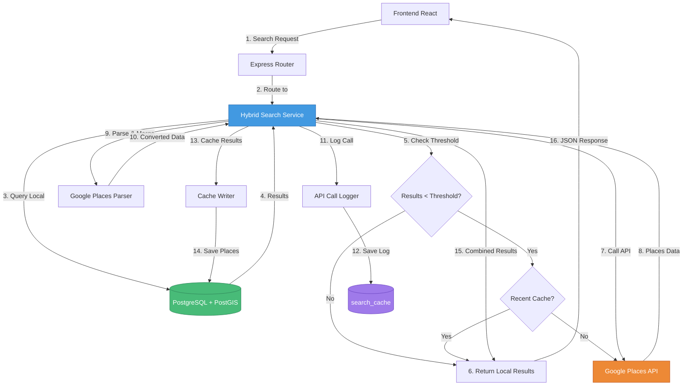
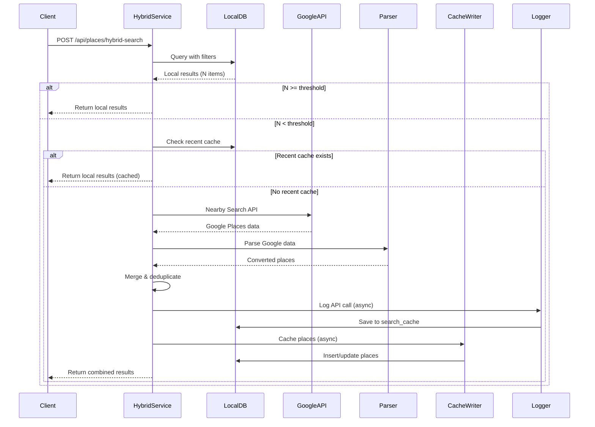

# Design Document - Busca Híbrida (Local + Google Places API)

## Overview

A funcionalidade de busca híbrida implementa uma estratégia inteligente de cache que prioriza o banco de dados local PostgreSQL + PostGIS (grátis) e complementa com Google Places API (pago) apenas quando necessário. O sistema salva automaticamente os novos resultados do Google no banco local para futuras consultas, reduzindo custos da API enquanto expande a cobertura geográfica de forma incremental e sob demanda.

### Objetivos

- Minimizar custos da Google Places API através de cache inteligente
- Expandir cobertura geográfica sob demanda
- Manter performance aceitável (< 500ms local, < 3s híbrido)
- Garantir transparência sobre origem dos dados para o usuário
- Evitar chamadas duplicadas à API através de cache temporal

### Escopo

Este design cobre:
- Nova rota `/api/places/hybrid-search` compatível com `/api/places/nearby`
- Serviço de integração com Google Places API
- Sistema de cache automático de resultados
- Logging de chamadas à API para monitoramento de custos
- Parser de dados do Google Places para formato local
- Indicadores visuais de origem dos dados no frontend

## Architecture

### High-Level Architecture



### Component Interaction Flow

1. **Request Phase**: Cliente envia requisição de busca com coordenadas, raio e filtros
2. **Local Search Phase**: Sistema busca primeiro no banco local com todos os filtros
3. **Threshold Check**: Verifica se resultados locais atendem o threshold mínimo
4. **Cache Check**: Se threshold não atingido, verifica se há busca similar recente (< 24h)
5. **API Call Phase**: Se necessário, chama Google Places API com mesmos parâmetros
6. **Parse & Merge Phase**: Converte dados do Google e remove duplicatas
7. **Logging Phase**: Registra chamada à API com métricas e custos
8. **Cache Phase**: Salva resultados do Google no banco local (background)
9. **Response Phase**: Retorna resultados combinados com metadata de origem

### Data Flow



## Components and Interfaces

### 1. Hybrid Search Service

**Responsabilidade**: Orquestrar busca híbrida entre banco local e Google Places API

**Interface**:
```typescript
interface HybridSearchService {
  search(params: SearchParams): Promise<SearchResponse>;
}

interface SearchParams {
  lat: number;
  lng: number;
  radius: number;
  category?: string;
  minRating?: number;
  hasPhone?: boolean;
  limit?: number;
}

interface SearchResponse {
  center: { lat: number; lng: number };
  radius_meters: number;
  total: number;
  summary: {
    local: number;
    google: number;
    from_recent_cache: boolean;
    radius_limited: boolean;
  };
  data: Place[];
  warning?: string;
}

interface Place {
  id: number;
  name: string;
  address: string;
  category: string;
  lat: number;
  lng: number;
  phone?: string;
  website?: string;
  rating?: number;
  user_ratings_total?: number;
  distance_km: string;
  metadata: {
    source: 'local' | 'google';
    cached_at?: string;
  };
}
```

**Algoritmo Principal**:
```javascript
async function hybridSearch(params) {
  // 1. Busca local
  const localResults = await searchLocalDatabase(params);
  
  // 2. Verifica threshold
  const threshold = getThreshold(); // MIN_RESULTS_THRESHOLD ou 10
  
  if (localResults.length >= threshold) {
    return formatResponse(localResults, 'local');
  }
  
  // 3. Verifica cache recente
  const recentCache = await checkRecentCache(params);
  if (recentCache) {
    return formatResponse(localResults, 'local', { from_recent_cache: true });
  }
  
  // 4. Chama Google Places API
  try {
    const googleResults = await callGooglePlacesAPI(params);
    
    // 5. Parse e merge
    const parsedResults = parseGooglePlaces(googleResults);
    const mergedResults = mergeAndDeduplicate(localResults, parsedResults);
    
    // 6. Log e cache (async)
    logAPICall(params, googleResults.length);
    cacheResults(parsedResults);
    
    return formatResponse(mergedResults, 'hybrid');
  } catch (error) {
    // 7. Fallback para resultados locais
    return formatResponse(localResults, 'local', { 
      warning: getErrorMessage(error) 
    });
  }
}
```

### 2. Google Places Service

**Responsabilidade**: Integração com Google Places API

**Interface**:
```typescript
interface GooglePlacesService {
  nearbySearch(params: GoogleSearchParams): Promise<GooglePlace[]>;
}

interface GoogleSearchParams {
  location: { lat: number; lng: number };
  radius: number;
  type?: string;
  keyword?: string;
}

interface GooglePlace {
  place_id: string;
  name: string;
  formatted_address: string;
  geometry: {
    location: { lat: number; lng: number };
  };
  types: string[];
  rating?: number;
  user_ratings_total?: number;
  formatted_phone_number?: string;
  website?: string;
}
```

**Implementação**:
```javascript
const https = require('https');

class GooglePlacesService {
  constructor(apiKey) {
    this.apiKey = apiKey;
    this.baseUrl = 'https://maps.googleapis.com/maps/api/place';
  }
  
  async nearbySearch(params) {
    const { location, radius, type, keyword } = params;
    
    // Limitar raio se necessário
    const maxRadius = process.env.GOOGLE_SEARCH_RADIUS_LIMIT || 5000;
    const limitedRadius = Math.min(radius, maxRadius);
    
    const url = `${this.baseUrl}/nearbysearch/json?` +
      `location=${location.lat},${location.lng}&` +
      `radius=${limitedRadius}&` +
      `key=${this.apiKey}` +
      (type ? `&type=${type}` : '') +
      (keyword ? `&keyword=${keyword}` : '');
    
    return new Promise((resolve, reject) => {
      const timeout = setTimeout(() => {
        reject(new Error('TIMEOUT'));
      }, 5000);
      
      https.get(url, (res) => {
        let data = '';
        
        res.on('data', (chunk) => data += chunk);
        
        res.on('end', () => {
          clearTimeout(timeout);
          
          try {
            const json = JSON.parse(data);
            
            if (json.status === 'OK') {
              resolve(json.results);
            } else if (json.status === 'ZERO_RESULTS') {
              resolve([]);
            } else {
              reject(new Error(json.status));
            }
          } catch (err) {
            reject(err);
          }
        });
      }).on('error', (err) => {
        clearTimeout(timeout);
        reject(err);
      });
    });
  }
}
```

### 3. Google Places Parser

**Responsabilidade**: Converter dados do Google Places para formato do banco local

**Interface**:
```typescript
interface GooglePlacesParser {
  parse(googlePlace: GooglePlace): LocalPlace;
  parseMany(googlePlaces: GooglePlace[]): LocalPlace[];
}

interface LocalPlace {
  name: string;
  address: string;
  category: string;
  lat: number;
  lng: number;
  google_place_id: string;
  phone?: string;
  website?: string;
  rating?: number;
  user_ratings_total?: number;
}
```

**Implementação**:
```javascript
class GooglePlacesParser {
  parse(googlePlace) {
    return {
      name: googlePlace.name,
      address: googlePlace.formatted_address,
      category: this.mapCategory(googlePlace.types[0]),
      lat: googlePlace.geometry.location.lat,
      lng: googlePlace.geometry.location.lng,
      google_place_id: googlePlace.place_id,
      phone: googlePlace.formatted_phone_number || null,
      website: googlePlace.website || null,
      rating: googlePlace.rating || null,
      user_ratings_total: googlePlace.user_ratings_total || null
    };
  }
  
  parseMany(googlePlaces) {
    return googlePlaces.map(place => this.parse(place));
  }
  
  mapCategory(googleType) {
    const categoryMap = {
      'lodging': 'Condomínio',
      'hospital': 'Hospital',
      'university': 'Universidade',
      'gym': 'Academia',
      'supermarket': 'Supermercado',
      'store': 'Loja',
      // ... mais mapeamentos
    };
    
    return categoryMap[googleType] || 'Estabelecimento';
  }
}
```

### 4. Cache Writer

**Responsabilidade**: Salvar resultados do Google no banco local

**Interface**:
```typescript
interface CacheWriter {
  cacheResults(places: LocalPlace[]): Promise<void>;
  cacheSingle(place: LocalPlace): Promise<void>;
}
```

**Implementação**:
```javascript
class CacheWriter {
  constructor(pool) {
    this.pool = pool;
  }
  
  async cacheResults(places) {
    // Executar em background sem bloquear
    setImmediate(async () => {
      for (const place of places) {
        try {
          await this.cacheSingle(place);
        } catch (err) {
          console.error('Erro ao cachear lugar:', err);
        }
      }
    });
  }
  
  async cacheSingle(place) {
    const query = `
      INSERT INTO places (
        name, address, category, location, google_place_id,
        phone, website, rating, user_ratings_total
      )
      VALUES ($1, $2, $3, ST_SetSRID(ST_MakePoint($4, $5), 4326), $6, $7, $8, $9, $10)
      ON CONFLICT (google_place_id) 
      DO UPDATE SET
        phone = COALESCE(places.phone, EXCLUDED.phone),
        website = COALESCE(places.website, EXCLUDED.website),
        rating = COALESCE(places.rating, EXCLUDED.rating),
        user_ratings_total = COALESCE(places.user_ratings_total, EXCLUDED.user_ratings_total)
    `;
    
    await this.pool.query(query, [
      place.name,
      place.address,
      place.category,
      place.lng,
      place.lat,
      place.google_place_id,
      place.phone,
      place.website,
      place.rating,
      place.user_ratings_total
    ]);
  }
}
```

### 5. API Call Logger

**Responsabilidade**: Registrar chamadas à API para monitoramento de custos

**Interface**:
```typescript
interface APICallLogger {
  logCall(params: LogParams): Promise<void>;
  logError(params: LogParams, error: Error): Promise<void>;
}

interface LogParams {
  lat: number;
  lng: number;
  radius: number;
  results_count: number;
  response_time_ms: number;
}
```

**Implementação**:
```javascript
class APICallLogger {
  constructor(pool) {
    this.pool = pool;
  }
  
  async logCall(params) {
    const estimatedCost = this.calculateCost(params.results_count);
    
    const query = `
      INSERT INTO search_cache (
        lat, lng, radius, results_count, 
        response_time_ms, estimated_cost, status
      )
      VALUES ($1, $2, $3, $4, $5, $6, 'completed')
    `;
    
    await this.pool.query(query, [
      params.lat,
      params.lng,
      params.radius,
      params.results_count,
      params.response_time_ms,
      estimatedCost
    ]);
  }
  
  async logError(params, error) {
    const query = `
      INSERT INTO search_cache (
        lat, lng, radius, error_message, status
      )
      VALUES ($1, $2, $3, $4, 'failed')
    `;
    
    await this.pool.query(query, [
      params.lat,
      params.lng,
      params.radius,
      error.message
    ]);
  }
  
  calculateCost(resultsCount) {
    // Google Places API: $0.032 por Nearby Search
    // + $0.017 por Place Details (se necessário)
    const nearbySearchCost = 0.032;
    return nearbySearchCost;
  }
}
```

## Data Models

### Database Schema

#### Tabela `places` (existente - com adições)

```sql
CREATE TABLE IF NOT EXISTS places (
  id SERIAL PRIMARY KEY,
  name VARCHAR(255) NOT NULL,
  address TEXT,
  category VARCHAR(100),
  location GEOGRAPHY(POINT, 4326) NOT NULL,
  google_place_id VARCHAR(255) UNIQUE,  -- NOVO: para evitar duplicatas
  phone VARCHAR(50),
  website TEXT,
  rating DECIMAL(2,1),
  user_ratings_total INTEGER,
  created_at TIMESTAMP DEFAULT CURRENT_TIMESTAMP,
  updated_at TIMESTAMP DEFAULT CURRENT_TIMESTAMP
);

-- Índices
CREATE INDEX IF NOT EXISTS idx_places_location ON places USING GIST(location);
CREATE INDEX IF NOT EXISTS idx_places_google_place_id ON places(google_place_id);
CREATE INDEX IF NOT EXISTS idx_places_category ON places(category);
```

#### Tabela `search_cache` (nova)

```sql
CREATE TABLE IF NOT EXISTS search_cache (
  id SERIAL PRIMARY KEY,
  lat DECIMAL(10, 7) NOT NULL,
  lng DECIMAL(10, 7) NOT NULL,
  radius INTEGER NOT NULL,
  results_count INTEGER,
  response_time_ms INTEGER,
  estimated_cost DECIMAL(10, 4),
  error_message TEXT,
  status VARCHAR(20) NOT NULL,  -- 'completed' ou 'failed'
  created_at TIMESTAMP DEFAULT CURRENT_TIMESTAMP
);

-- Índices
CREATE INDEX IF NOT EXISTS idx_search_cache_location ON search_cache(lat, lng);
CREATE INDEX IF NOT EXISTS idx_search_cache_created_at ON search_cache(created_at);
CREATE INDEX IF NOT EXISTS idx_search_cache_status ON search_cache(status);
```

### API Response Format

```json
{
  "center": {
    "lat": -23.1858,
    "lng": -46.8978
  },
  "radius_meters": 5000,
  "total": 45,
  "summary": {
    "local": 35,
    "google": 10,
    "from_recent_cache": false,
    "radius_limited": false
  },
  "data": [
    {
      "id": 123,
      "name": "Condomínio Exemplo",
      "address": "Rua Exemplo, 123 - Jundiaí, SP",
      "category": "Condomínio",
      "lat": -23.1858,
      "lng": -46.8978,
      "phone": "(11) 1234-5678",
      "website": "https://exemplo.com",
      "rating": 4.5,
      "user_ratings_total": 120,
      "distance_km": "0.85",
      "metadata": {
        "source": "local",
        "cached_at": "2024-01-15T10:30:00Z"
      }
    }
  ],
  "warning": null
}
```


## Correctness Properties

*A property is a characteristic or behavior that should hold true across all valid executions of a system—essentially, a formal statement about what the system should do. Properties serve as the bridge between human-readable specifications and machine-verifiable correctness guarantees.*

### Property Reflection

Após análise do prework, identifiquei as seguintes redundâncias e consolidações:

**Redundâncias Identificadas**:
- Propriedades 11.1-11.9 são todas parte da propriedade 11.10 (round-trip de conversão)
- Propriedades 1.4 e 2.4 podem ser consolidadas em uma única propriedade sobre marcação de origem
- Propriedades 5.2 e 5.3 podem ser consolidadas em uma propriedade sobre status de log

**Consolidações Realizadas**:
- Todos os requisitos de conversão individual (11.1-11.9) foram consolidados na propriedade de round-trip (11.10)
- Marcação de origem (1.4 e 2.4) consolidada em uma única propriedade
- Status de log (5.2 e 5.3) consolidado em uma única propriedade

### Property 1: Busca Local Sempre Executada Primeiro

*For any* requisição de busca válida, o sistema deve executar a busca no banco de dados local antes de qualquer chamada à API do Google Places.

**Validates: Requirements 1.1**

### Property 2: Filtros Aplicados na Busca Local

*For any* requisição de busca com filtros (raio, categorias, rating mínimo), todos os resultados do banco local devem respeitar todos os filtros especificados.

**Validates: Requirements 1.2**

### Property 3: Marcação de Origem dos Resultados

*For any* resultado retornado pelo sistema, o campo `metadata.source` deve existir e conter exatamente um dos valores "local" ou "google", correspondendo à origem real do dado.

**Validates: Requirements 1.4, 2.4, 6.1**

### Property 4: Fallback para Google Places

*For any* busca onde os resultados locais são menores que o threshold configurado e não existe cache recente, o sistema deve executar uma chamada à API do Google Places.

**Validates: Requirements 2.1**

### Property 5: Preservação de Parâmetros na Chamada à API

*For any* chamada à API do Google Places, os parâmetros de busca (coordenadas, raio, categorias) devem ser os mesmos da requisição original do usuário, respeitando o limite de raio configurado.

**Validates: Requirements 2.2, 7.3**

### Property 6: Remoção de Duplicatas

*For any* conjunto de resultados combinados (locais + Google), não deve haver duplicatas baseadas no campo `google_place_id`.

**Validates: Requirements 2.5**

### Property 7: Cache Automático de Resultados

*For any* resultado retornado pela API do Google Places, o sistema deve salvar esse resultado no banco de dados local.

**Validates: Requirements 3.1**

### Property 8: Conversão de Dados Round-Trip

*For any* objeto válido retornado pela API do Google Places, a conversão para o formato do banco local deve produzir um objeto que contém todos os campos obrigatórios (name, address, category, lat, lng, google_place_id) com valores válidos.

**Validates: Requirements 3.2, 11.1, 11.2, 11.3, 11.4, 11.5, 11.6, 11.7, 11.8, 11.9, 11.10**

### Property 9: Prevenção de Duplicatas no Cache

*For any* tentativa de inserir um lugar com `google_place_id` já existente no banco, o sistema deve atualizar apenas os campos vazios do registro existente, sem criar duplicata.

**Validates: Requirements 3.3, 3.4**

### Property 10: Formato de Coordenadas PostGIS

*For any* coordenada salva no banco de dados, ela deve estar no formato PostGIS correto (SRID 4326) e ser recuperável com os mesmos valores de latitude e longitude.

**Validates: Requirements 3.5**

### Property 11: Validação de Threshold

*For any* valor de threshold configurado, o sistema deve aceitar valores entre 0 e 100, e usar o valor padrão de 10 quando a variável de ambiente não estiver definida.

**Validates: Requirements 4.1, 4.2, 4.3**

### Property 12: Logging Completo de Chamadas à API

*For any* chamada à API do Google Places, o sistema deve registrar um log contendo timestamp, coordenadas, raio, número de resultados, tempo de resposta e custo estimado.

**Validates: Requirements 5.1, 5.4, 5.5**

### Property 13: Status de Log Correto

*For any* log de chamada à API, o status deve ser "completed" para chamadas bem-sucedidas e "failed" para chamadas com erro.

**Validates: Requirements 5.2, 5.3**

### Property 14: Resumo de Resultados por Origem

*For any* resposta do sistema, o campo `summary` deve conter contagens corretas de resultados por origem (local e google), e a soma dessas contagens deve ser igual ao total de resultados retornados.

**Validates: Requirements 6.2, 6.3**

### Property 15: Limitação de Raio

*For any* requisição com raio superior ao limite configurado (GOOGLE_SEARCH_RADIUS_LIMIT), o sistema deve usar o limite configurado na chamada à API e indicar no response que o raio foi limitado.

**Validates: Requirements 7.1, 7.2, 7.4**

### Property 16: Tratamento de Erros da API

*For any* erro retornado pela API do Google Places, o sistema deve retornar status HTTP 200 com os resultados locais disponíveis e uma mensagem de aviso apropriada.

**Validates: Requirements 2.3, 8.1, 8.2, 8.3, 8.4, 8.5**

### Property 17: Cache Temporal de Buscas

*For any* requisição de busca, se existir uma busca similar (mesmas coordenadas ±100m e mesmo raio) com status "completed" nas últimas 24 horas, o sistema deve usar apenas resultados locais e indicar `from_recent_cache: true`.

**Validates: Requirements 9.1, 9.2, 9.3, 9.4**

### Property 18: Compatibilidade de Parâmetros

*For any* conjunto de parâmetros válidos aceitos pela rota `/api/places/nearby`, a nova rota `/api/places/hybrid-search` deve aceitar os mesmos parâmetros e retornar resposta no mesmo formato base, com campos adicionais de metadata.

**Validates: Requirements 10.1, 10.2, 10.3, 10.4**

## Error Handling

### Error Categories

#### 1. Google Places API Errors

**Authentication Error (INVALID_REQUEST)**:
```javascript
{
  status: 200,
  data: localResults,
  warning: "API key inválida - retornando apenas resultados locais",
  summary: { local: localResults.length, google: 0 }
}
```

**Quota Exceeded (OVER_QUERY_LIMIT)**:
```javascript
{
  status: 200,
  data: localResults,
  warning: "Limite de API atingido - retornando apenas resultados locais",
  summary: { local: localResults.length, google: 0 }
}
```

**Timeout (5 segundos)**:
```javascript
{
  status: 200,
  data: localResults,
  warning: "Timeout na API do Google - retornando apenas resultados locais",
  summary: { local: localResults.length, google: 0 }
}
```

**Network Error**:
```javascript
{
  status: 200,
  data: localResults,
  warning: "Erro de conexão com API do Google - retornando apenas resultados locais",
  summary: { local: localResults.length, google: 0 }
}
```

#### 2. Database Errors

**Connection Error**:
```javascript
{
  status: 500,
  error: "Erro ao conectar com banco de dados"
}
```

**Query Error**:
```javascript
{
  status: 500,
  error: "Erro ao executar busca no banco de dados"
}
```

#### 3. Validation Errors

**Missing Required Parameters**:
```javascript
{
  status: 400,
  error: "Parâmetros obrigatórios: lat, lng"
}
```

**Invalid Coordinates**:
```javascript
{
  status: 400,
  error: "Coordenadas inválidas"
}
```

**Invalid Radius**:
```javascript
{
  status: 400,
  error: "Raio deve ser um número positivo"
}
```

### Error Handling Strategy

1. **Graceful Degradation**: Sempre retornar resultados locais quando API do Google falhar
2. **Transparent Errors**: Incluir mensagens de aviso claras sobre problemas
3. **Logging**: Registrar todos os erros no console com nível ERROR
4. **No Blocking**: Erros no cache ou logging não devem bloquear resposta ao usuário
5. **Timeout Protection**: Cancelar requisições à API após 5 segundos

### Error Logging

```javascript
function logError(context, error) {
  console.error(`[HybridSearch] ${context}:`, {
    message: error.message,
    stack: error.stack,
    timestamp: new Date().toISOString()
  });
}
```

## Testing Strategy

### Dual Testing Approach

A estratégia de testes combina testes unitários e testes baseados em propriedades (property-based testing) para garantir cobertura abrangente:

- **Testes Unitários**: Validam exemplos específicos, casos extremos e condições de erro
- **Testes de Propriedade**: Validam propriedades universais através de múltiplas entradas geradas aleatoriamente
- **Complementaridade**: Testes unitários capturam bugs concretos; testes de propriedade verificam correção geral

### Property-Based Testing Configuration

**Biblioteca**: fast-check (JavaScript/TypeScript)

**Configuração**:
- Mínimo de 100 iterações por teste de propriedade
- Cada teste deve referenciar a propriedade do design document
- Formato de tag: `Feature: hybrid-search, Property {número}: {texto da propriedade}`

**Exemplo de Teste de Propriedade**:

```javascript
const fc = require('fast-check');

describe('Feature: hybrid-search, Property 2: Filtros Aplicados na Busca Local', () => {
  it('should apply all filters to local database search', async () => {
    await fc.assert(
      fc.asyncProperty(
        fc.record({
          lat: fc.double({ min: -90, max: 90 }),
          lng: fc.double({ min: -180, max: 180 }),
          radius: fc.integer({ min: 100, max: 20000 }),
          category: fc.constantFrom('Condomínio', 'Hospital', 'Academia'),
          minRating: fc.double({ min: 0, max: 5 })
        }),
        async (params) => {
          const results = await hybridSearchService.search(params);
          
          // Verificar que todos os resultados respeitam os filtros
          results.data.forEach(place => {
            expect(place.category).toContain(params.category);
            if (place.rating) {
              expect(place.rating).toBeGreaterThanOrEqual(params.minRating);
            }
            
            const distance = calculateDistance(
              params.lat, params.lng,
              place.lat, place.lng
            );
            expect(distance).toBeLessThanOrEqual(params.radius);
          });
        }
      ),
      { numRuns: 100 }
    );
  });
});
```

### Unit Testing Strategy

**Casos de Teste Unitário**:

1. **Busca Local**:
   - Busca com resultados suficientes (>= threshold)
   - Busca com resultados insuficientes (< threshold)
   - Busca sem resultados
   - Aplicação de filtros individuais
   - Aplicação de múltiplos filtros

2. **Integração com Google Places**:
   - Chamada bem-sucedida à API
   - Erro de autenticação
   - Erro de quota excedida
   - Timeout
   - Erro de rede

3. **Cache de Resultados**:
   - Inserção de novo lugar
   - Atualização de lugar existente (enriquecimento)
   - Prevenção de duplicatas
   - Conversão de coordenadas PostGIS

4. **Logging**:
   - Log de chamada bem-sucedida
   - Log de chamada com erro
   - Cálculo de custo estimado

5. **Cache Temporal**:
   - Busca similar recente (< 24h)
   - Busca similar antiga (> 24h)
   - Busca similar com status "failed"

6. **Parser**:
   - Conversão de todos os campos
   - Mapeamento de categorias
   - Tratamento de campos opcionais

### Integration Testing

**Cenários de Integração**:

1. **Fluxo Completo Híbrido**:
   - Busca local insuficiente → Chamada à API → Cache → Resposta combinada

2. **Fluxo com Cache Recente**:
   - Busca local insuficiente → Cache recente encontrado → Resposta local

3. **Fluxo com Erro da API**:
   - Busca local insuficiente → Erro da API → Resposta local com aviso

4. **Fluxo de Enriquecimento**:
   - Lugar já existe → Nova busca retorna mais dados → Campos vazios atualizados

### Test Data Generators

```javascript
// Gerador de coordenadas válidas
const coordGen = fc.record({
  lat: fc.double({ min: -90, max: 90 }),
  lng: fc.double({ min: -180, max: 180 })
});

// Gerador de parâmetros de busca
const searchParamsGen = fc.record({
  lat: fc.double({ min: -90, max: 90 }),
  lng: fc.double({ min: -180, max: 180 }),
  radius: fc.integer({ min: 100, max: 20000 }),
  category: fc.option(fc.constantFrom('Condomínio', 'Hospital', 'Academia')),
  minRating: fc.option(fc.double({ min: 0, max: 5 })),
  hasPhone: fc.option(fc.boolean()),
  limit: fc.option(fc.integer({ min: 1, max: 100 }))
});

// Gerador de lugares do Google
const googlePlaceGen = fc.record({
  place_id: fc.uuid(),
  name: fc.string({ minLength: 3, maxLength: 100 }),
  formatted_address: fc.string({ minLength: 10, maxLength: 200 }),
  geometry: fc.record({
    location: coordGen
  }),
  types: fc.array(fc.constantFrom('lodging', 'hospital', 'gym'), { minLength: 1, maxLength: 3 }),
  rating: fc.option(fc.double({ min: 0, max: 5 })),
  user_ratings_total: fc.option(fc.integer({ min: 0, max: 10000 })),
  formatted_phone_number: fc.option(fc.string()),
  website: fc.option(fc.webUrl())
});
```

### Performance Testing

Embora não sejam testes automatizados, os seguintes benchmarks devem ser verificados manualmente:

- **Busca Local**: < 500ms para 1000 lugares no raio
- **Busca Híbrida**: < 3s incluindo chamada à API
- **Cache de Resultados**: Não bloquear resposta (assíncrono)
- **Logging**: < 50ms para salvar log

### Test Coverage Goals

- **Cobertura de Código**: Mínimo 80% de linhas cobertas
- **Cobertura de Propriedades**: 100% das propriedades testadas
- **Cobertura de Casos de Erro**: Todos os tipos de erro testados
- **Cobertura de Integração**: Todos os fluxos principais testados


## Implementation Details

### File Structure

```
backend/src/
├── services/
│   ├── hybridSearchService.js      # Orquestrador principal
│   ├── googlePlacesService.js      # Integração com Google Places API
│   ├── googlePlacesParser.js       # Parser de dados do Google
│   ├── cacheWriter.js              # Writer de cache assíncrono
│   └── apiCallLogger.js            # Logger de chamadas à API
├── routes/
│   └── hybridSearch.js             # Rota /api/places/hybrid-search
├── utils/
│   ├── distanceCalculator.js      # Cálculo de distâncias
│   └── deduplicator.js            # Remoção de duplicatas
└── db.js                           # Pool de conexões (existente)

frontend/src/
├── services/
│   └── places.ts                   # Atualizar com método hybridSearch
└── pages/
    └── DashboardPage.tsx           # Atualizar para usar busca híbrida
```

### Route Implementation

**File**: `backend/src/routes/hybridSearch.js`

```javascript
const express = require('express');
const router = express.Router();
const HybridSearchService = require('../services/hybridSearchService');
const pool = require('../db');

const hybridSearchService = new HybridSearchService(pool);

router.get('/api/places/hybrid-search', async (req, res) => {
  try {
    const { lat, lng, radius = 5000, limit = 50, category, minRating, hasPhone } = req.query;
    
    // Validações
    if (!lat || !lng) {
      return res.status(400).json({ 
        error: "Parâmetros obrigatórios: lat, lng" 
      });
    }
    
    const latitude = parseFloat(lat);
    const longit
## Implementation Details

### File Structure

```
backend/src/
├── services/
│   ├── hybridSearchService.js      # Orquestrador principal
│   ├── googlePlacesService.js      # Integração com Google Places API
│   ├── googlePlacesParser.js       # Parser de dados do Google
│   ├── cacheWriter.js              # Writer de cache assíncrono
│   └── apiCallLogger.js            # Logger de chamadas à API
└── routes/
    └── hybridSearch.js             # Rota /api/places/hybrid-search
```

### Database Migration

```sql
-- Adicionar suporte para busca híbrida
ALTER TABLE places ADD COLUMN IF NOT EXISTS google_place_id VARCHAR(255) UNIQUE;
CREATE INDEX IF NOT EXISTS idx_places_google_place_id ON places(google_place_id);

-- Criar tabela de cache de buscas
CREATE TABLE IF NOT EXISTS search_cache (
  id SERIAL PRIMARY KEY,
  lat DECIMAL(10, 7) NOT NULL,
  lng DECIMAL(10, 7) NOT NULL,
  radius INTEGER NOT NULL,
  results_count INTEGER,
  response_time_ms INTEGER,
  estimated_cost DECIMAL(10, 4),
  error_message TEXT,
  status VARCHAR(20) NOT NULL CHECK (status IN ('completed', 'failed')),
  created_at TIMESTAMP DEFAULT CURRENT_TIMESTAMP
);

CREATE INDEX idx_search_cache_location ON search_cache(lat, lng);
CREATE INDEX idx_search_cache_created_at ON search_cache(created_at);
CREATE INDEX idx_search_cache_status ON search_cache(status);
```

### Environment Variables

```bash
# Google Places API
GOOGLE_PLACES_API_KEY=your_api_key_here

# Hybrid Search Configuration
MIN_RESULTS_THRESHOLD=10              # Mínimo de resultados locais antes de chamar API
GOOGLE_SEARCH_RADIUS_LIMIT=5000       # Raio máximo em metros para chamadas à API
```

### Key Algorithms

**Merge and Deduplicate**:
```javascript
mergeAndDeduplicate(localResults, googleResults) {
  const localPlaceIds = new Set(
    localResults
      .filter(p => p.google_place_id)
      .map(p => p.google_place_id)
  );
  
  const uniqueGoogleResults = googleResults
    .filter(p => !localPlaceIds.has(p.google_place_id));
  
  return [...localResults, ...uniqueGoogleResults];
}
```

**Recent Cache Check**:
```javascript
async checkRecentCache(params) {
  const query = `
    SELECT id FROM search_cache 
    WHERE status = 'completed'
      AND created_at > NOW() - INTERVAL '24 hours'
      AND ABS(lat - $1) < 0.001
      AND ABS(lng - $2) < 0.001
      AND ABS(radius - $3) < 100
    LIMIT 1
  `;
  
  const result = await this.pool.query(query, [params.lat, params.lng, params.radius]);
  return result.rows.length > 0;
}
```

## Deployment Checklist

### Pre-Deployment
- [ ] Criar API key do Google Places API
- [ ] Configurar variáveis de ambiente
- [ ] Executar migration do banco de dados
- [ ] Testar conexão com Google Places API

### Post-Deployment
- [ ] Verificar logs de erro
- [ ] Monitorar custos da API
- [ ] Validar cache funcionando
- [ ] Testar fallback em caso de erro

## Monitoring Queries

```sql
-- Custos diários
SELECT DATE(created_at) as date, COUNT(*) as calls, SUM(estimated_cost) as cost
FROM search_cache WHERE status = 'completed'
GROUP BY DATE(created_at) ORDER BY date DESC;

-- Taxa de sucesso
SELECT status, COUNT(*) as count
FROM search_cache GROUP BY status;
```

## Future Enhancements

1. **Cache Inteligente por Região**: Pré-popular regiões populares
2. **Batch Processing**: Processar múltiplas buscas em paralelo
3. **Analytics Dashboard**: Interface para monitorar custos e uso
4. **Rate Limiting**: Limitar chamadas à API por usuário
5. **Webhook Notifications**: Alertas quando quota próxima do limite

